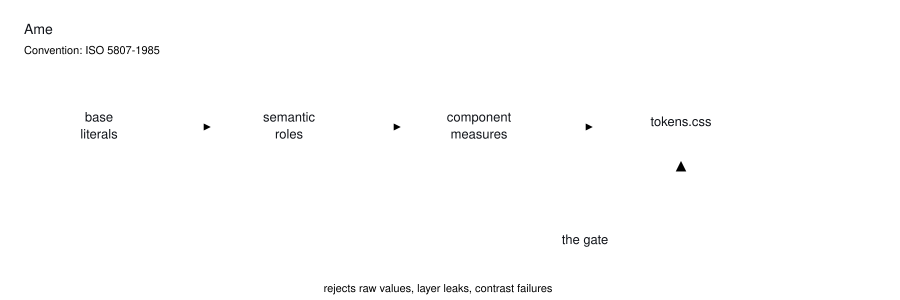

# Ame

Ame is a design token system with an enforcement gate: 3 layers of DTCG tokens compiled to CSS custom properties, and a CI check that fails any build where a scanned surface hand-writes a value the tokens already own.

**[Contract](tokens/contract.md)** · **[Decisions](tokens/decisions.md)** · **[Outcomes](tokens/outcomes.md)** · **[Fixtures](examples/README.md)** · **[Lexicon](docs/LEXICON.md)** · **[Standard](STANDARD.md)**

Apache-2.0 — fork it, ship it, sell what you build on it. The one thing the
licence withholds is the **name**: section 6 grants no trademark rights, so
rename your fork. The four documents carrying the reasoning — [contract](tokens/contract.md),
[decisions](tokens/decisions.md), [STANDARD.md](STANDARD.md), [lexicon](docs/LEXICON.md) —
are additionally offered under CC BY 4.0 so they can be quoted in a paper or a
talk without arguing about whether a software licence covers prose. See
[LICENSE](LICENSE), [LICENSE-DOCS](LICENSE-DOCS) and [NOTICE](NOTICE); cite it
via [CITATION.cff](CITATION.cff).

**New here?** Three doors, and they want different things.

| You are | Start at | It takes |
|---|---|---|
| **Assessing the work** — a hiring manager, a peer, anyone deciding whether this is real | [The one claim, checked](#the-one-claim-checked) | 60 seconds, no clone |
| **Adopting the tokens** in your own app | [Getting started](#getting-started) | one install |
| **Contributing** a change | [CONTRIBUTING.md](CONTRIBUTING.md) — `pnpm gate` green *is* the install test | one install |

## The one claim, checked

This system says a build fails when a scanned file hand-writes a value the
tokens already own. You do not have to take that on trust, and you do not have
to clone anything to see it: `examples/violating/` is a panel written to break
the rules on purpose, and [the CI log](../../actions) shows the gate rejecting
it on every push, naming the literal it found and the token it collided with.

```
D2 restated: examples/violating/panel.css:
  "0px 1px 6px 0px rgb(16 19 25 / 0.06)" == component.glass.drop
```

A gate nobody has watched fail is indistinguishable from a gate that cannot.
That fixture is the difference, and `pnpm gate:fixtures` is green only when the
gate rejected it — so a clause that quietly stops catching turns CI red instead
of silent.


<picture>
  <source media="(prefers-color-scheme: dark)" srcset="docs/architecture-dark.svg">
  
</picture>

<sub>Drawn to ISO 5807-1985, in the same symbols the system's own flowchart component uses, and coloured from the tokens themselves — so a colour change in <code>base/color.json</code> changes this picture or fails the build (<code>pnpm diagram:check</code>). Both themes, because the system has both.</sub>

## What's in the box

The consumable unit is `packages/ame-tokens` plus the gate.

| Piece | What it is |
|---|---|
| `packages/ame-tokens/` | DTCG-format tokens in 3 layers (base, semantic, component; the count is generated in the table above), a build with no dependencies outside Node's standard library, and the emitted `tokens.css` |
| `tokens/check.mjs` + `tokens/invariants.json` + `tokens/contract.md` | the gate: every rule stated once in the contract, held as data in invariants, judged in one place |
| `examples/` | 1 compliant fixture inside the real gate's scan, 1 violating fixture the gate must reject on every run |
| `tokens/decisions.md` + `docs/` | dated decision records (counted in the table above), the naming lexicon, the extraction preflight, and what the citations point at |
| `components/ame/` | demo chrome for the docs surface (nav, footer, top bar, panel wall, flowchart). It is not a component library, and nothing else here is either |

## Requirements

Node 24 (`.nvmrc`) and pnpm 11.5.1 (pinned in `package.json > packageManager`). The token build itself has zero dependencies; the gate resolves `ame-tokens` through the pnpm workspace, so install first:

```bash
pnpm install
```

## Getting started

**Fork the system (the intended use).** Replace the values, keep the law. Ame separates data (the token JSON), method (build + gate), and output (`tokens.css`), so your palette drops in without touching the enforcement:

```bash
# 1. edit packages/ame-tokens/base/*.json — your colors, type ramp, spacing, motion
# 2. point tokens/invariants.json > scan_roots at your app's directories
pnpm ame build     # emits tokens.css; throws rather than emit a partial file
pnpm gate          # every clause; exit 1 on any violation or drift growth
pnpm gate:fixtures # proves the gate still rejects the violating fixture
```

**Adopt the tokens as-is.** Import `packages/ame-tokens/tokens.css` and bind the custom properties. You inherit a system whose every rendered contrast pair is measured in both themes. One thing to know before you do: the tokens are emitted under a `.portfolio-root` class, so that class has to be on an ancestor of anything binding them, and `[data-theme="dark"]` under it re-points the themed aliases. The name lags the extraction and is a breaking rename, so it is written down rather than quietly changed.

**Point the gate at an existing codebase.** Retarget `scan_roots` at your own CSS and components to catch hand-written values, base-layer reads, and unmeasured contrast pairs. Limit, stated plainly: the restated-value clause compares against Ame's resolved token values, so the gate runs alongside the token build, never standalone.

## The gate

Every condition lives once in `contract.md`, as data in `invariants.json`, and is judged once in `check.mjs`. The clause families:

| Family | Holds that |
|---|---|
| F, N | tokens satisfy the DTCG value schemas, and one word means one concept across every path and exported symbol |
| B | the committed `tokens.css` is byte-identical to a fresh build, and stamps the manifest version |
| L | references point down the layers, never up or sideways |
| C, CV | every rendered foreground/background pair meets its WCAG minimum, in light and dark, and no rendered pair goes unmeasured |
| D | one home per value: a hand-written literal equal to a token fails, named alongside the token it collides with |
| S | sizes, durations, radii, and z-indexes are scale members, drift ratcheted downward only |
| U, H | surfaces bind semantic roles, never base primitives; the uses-graph stays acyclic; clientless tokens are counted and capped |
| X | the record: baselines move down in the change that earned them, and a clause pointed at a missing path fails loudly instead of passing on an empty tree |
| W, Z | CI steps name scripts that exist in the tree, and every contract clause maps to an invariant and a check |

The fixtures exist because a gate that has never been seen to fail is not evidence. `pnpm gate:fixtures` runs the gate against a deliberately violating panel and passes only when the gate rejects it, so a silent regression in the gate itself turns the fixture run red.

## Scope and limits

The gate governs what its scan roots name, and nothing else. Five things worth knowing before you rely on it.

- **The restated-value check needs the token build present**, so the gate is a workspace citizen, never a standalone binary.
- **Spacing is a scale here, not an enforced derivation.** The `unit.*` ramp exists and the `space.*` roles reference it, but the clause that held a utility framework's spacing base equal to `unit.1` (P6) governed a config file that stayed in the monorepo, so it left with its subject. Decision D-49 records that parity and reads as current; it describes the tree Ame was extracted from. Which mechanism should author layout spacing at all — a `space.*` role or a utility class — is genuinely open there and here.
- **Many tokens have no consumer in this tree** — the count is the H1 row in the table above, generated rather than typed — because the surfaces that consumed them stayed in the monorepo Ame was extracted from. It is baselined and ratcheted so it cannot grow; a fact about the extraction, not about the tokens.
- **One value sits off its scale on purpose**: a 13.85px glyph height in the top bar that the surrounding control was sized around. Baselined at 1, with the reason in the code.
- **`components/ame` is demo chrome.** Treat it as reference, not product.

Clauses whose subject stayed with the monorepo — a byte budget over `public/`, the docs-site registry, a vendored-code manifest, the parity checks against portfolio components — were removed rather than pointed at something that merely exists, because a clause scanning an empty tree reports green (D-53). `docs/PROVENANCE.md` says what every absent citation pointed at.

## Method

4 homes for 4 kinds of statement: conditions in `contract.md`, reasons in `decisions.md`, numbers in `outcomes.md`, procedures in `deliverables.md`. A rule written twice can disagree with itself, so nothing is written twice. The decision log is chronological and annotated rather than rewritten; the lineage is the dated lab notebook of Noble (2009) and the data/method/output separation of Marwick's research compendia, applied to design tokens. The format is the [DTCG specification](https://tr.designtokens.org/format/), 2025.10; decision D-1 records why, against [Style Dictionary](https://github.com/style-dictionary/style-dictionary)'s dialect. Contrast is the [WCAG 2.2 relative-luminance ratio](https://www.w3.org/TR/WCAG22/#dfn-contrast-ratio), computed from resolved token values in `tokens/contrast.mjs`.

## Numbers

<!-- numbers:start -->

Measured on the tree that ships, by the commands shown, and regenerated from it
rather than typed. `pnpm numbers:check` re-runs every command on every push, so
these figures describe **this commit** — a stronger claim than a date, and one
that cannot quietly go stale.

| | | |
|---|---|---|
| Tokens | 339 | `pnpm gate` header |
| Contrast pairs | 19, both themes, all passing their minimums | `pnpm gate` contrast table |
| Emitted CSS | 485 lines | `wc -l packages/ame-tokens/tokens.css` |
| Decisions | 14, dated | `grep -c "^## D-" tokens/decisions.md` |
| Tokens with no consumer here | 116 of 339 | `pnpm gate` H1 line |

<!-- numbers:end -->

## Contributing, license, citation

Issues and PRs are welcome; [CONTRIBUTING.md](CONTRIBUTING.md) is the 5-minute version, and `pnpm gate` green is the install test. Apache-2.0, stated in [LICENSE](LICENSE), and clause L1 in the gate reads every file that declares it so the eight declarations cannot disagree. The name is withheld (§6, [NOTICE](NOTICE)); the four reasoning documents are additionally offered under CC BY 4.0 ([LICENSE-DOCS](LICENSE-DOCS)). One piece of this tree is not the author's: the 218 icons under `components/ame/icons/` are the Schweizerische Eidgenossenschaft's set, MIT, whose permission notice is reproduced in [THIRD-PARTY-NOTICES](THIRD-PARTY-NOTICES) because MIT requires it to travel — L1 checks that too. To cite the system, use [CITATION.cff](CITATION.cff).
